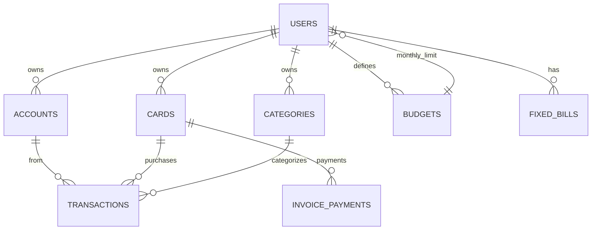

# 📊 Arquitetura de Analytics - NoCry Finance

**Criado em:** 2025-01-11  
**Objetivo:** Documentar a arquitetura completa para implementação da página `/analytics` com gráficos avançados, KPIs, drill-down e alertas inteligentes.

---

## 🎯 Resumo Executivo

Esta especificação detalha a criação de uma página de analytics profissional para NoCry Finance, com foco em:
- **Performance:** Views materializadas + caching agressivo
- **Separação Caixa x Competência:** Toggle para alternar entre regimes contábeis
- **Insights Acionáveis:** KPIs, alertas automáticos, previsões
- **UX de Nível Profissional:** Interações, filtros globais, drill-down

---

## 📁 Mapeamento da Arquitetura Existente

### 1️⃣ **TABELAS DO BANCO DE DADOS**



#### `transactions` (Movimentações)
- **Arquivo:** `supabase/sql/020_financas.sql`
- **Colunas Principais:**
  - `id`, `user_id`, `type` (expense/income/transfer)
  - `account_id` (conta bancária - dinheiro REAL)
  - `card_id` (cartão de crédito - compromisso FUTURO)
  - `category_id`, `amount_cents`, `occurred_at`
  - `installment_index`, `installment_total` (parcelamento)
  - `fixed_id` (vínculo com fixed_bills)
  - `transfer_group_id` (agrupamento de transferências)
- **Índices:** `user_id`, `occurred_at`, `account_id`, `card_id`, `category_id`

**🔑 REGRA DE OURO:**
- `card_id IS NULL` → CAIXA (dinheiro saiu/entrou)
- `card_id IS NOT NULL` → COMPETÊNCIA (compra no cartão, ainda não paga)

#### `invoice_payments` (Pagamentos de Faturas)
- **Arquivo:** `supabase/sql/045_invoice_payments.sql`
- **Colunas:** `id`, `user_id`, `card_id`, `amount_cents`, `paid_at`, `source_account_id`, `notes`
- **Propósito:** Registra quando uma fatura de cartão foi PAGA (saída de caixa REAL)
- **Índices:** `user_id`, `paid_at`, `card_id`, `source_account_id`

#### `accounts` (Contas Bancárias)
- **Arquivo:** `supabase/sql/020_financas.sql`
- **Colunas:** `id`, `user_id`, `name`, `initial_balance_cents`
- **Propósito:** Contas correntes, poupanças, carteiras (dinheiro real)

#### `cards` (Cartões de Crédito)
- **Arquivo:** `supabase/sql/020_financas.sql`
- **Colunas:** `id`, `user_id`, `name`, `limit_cents`, `closing_day`, `due_day`
- **Propósito:** Cartões de crédito com ciclo de faturamento

#### `categories` (Categorias)
- **Arquivo:** `supabase/sql/020_financas.sql`
- **Colunas:** `id`, `user_id`, `name`, `type` (expense/income), `archived`
- **Propósito:** Categorias personalizadas para organização

#### `budgets` (Orçamentos)
- **Arquivo:** `supabase/sql/030_budgets.sql`
- **Colunas:** `id`, `user_id`, `month_key` (YYYY-MM), `amount_cents`
- **Propósito:** Limite de gastos mensal definido pelo usuário

#### `fixed_bills` (Contas Fixas)
- **Arquivo:** (verificar se existe SQL de criação)
- **Colunas:** `id`, `user_id`, `name`, `amount_cents`, `day_of_month`, `type`, `is_active`
- **Propósito:** Despesas recorrentes mensais (ex: aluguel, internet)

---

### 2️⃣ **VIEWS SQL EXISTENTES**

#### `pf_month_summary`
- **Arquivo:** `supabase/sql/020_financas.sql` (linhas 97-139)
- **Propósito:** Resumo do mês corrente (receitas, despesas, líquido)
- **Problema:** ❌ Soma TODAS as expenses (inclui compras de cartão)
- **Status:** Legado, não usar para analytics

#### `card_invoices_current`
- **Arquivo:** `supabase/sql/020_financas.sql` (linhas 148-219)
- **Propósito:** Calcula fatura ATUAL de cada cartão (cycle-aware)
- **Retorna:** `card_id`, `cycle_start`, `cycle_end`, `amount_cents`, `due_date`, `days_to_due`
- **Problema:** ❌ NÃO considera pagamentos

#### `card_invoices_with_payments`
- **Arquivo:** `supabase/sql/046_card_invoices_with_payments.sql`
- **Propósito:** Fatura ATUAL com pagamentos (charges - payments)
- **Retorna:** `total_charges_cents`, `total_payments_cents`, `balance_cents`
- **Status:** ✅ USAR ESTA para cálculo de fatura aberta

#### `pf_fixed_remaining_current_month`
- **Arquivo:** `supabase/sql/026_fixed_remaining_view.sql`
- **Propósito:** Fixas ainda não lançadas no mês
- **Retorna:** `fixed_remaining_cents`, `items_remaining`
- **Status:** ✅ USAR para SDM e projeções

---

### 3️⃣ **SERVIÇOS E HOOKS EXISTENTES**

#### Serviços (`src/services/`)
| Arquivo | Propósito |
|---------|-----------|
| `analytics.ts` | Séries temporais, net by period (REGIME DE CAIXA) |
| `transactions.ts` | CRUD de transações |
| `cards.ts` | CRUD de cartões, faturas |
| `categories.ts` | CRUD de categorias |
| `budgets.ts` | CRUD de orçamentos |
| `accounts.ts` | CRUD de contas bancárias |
| `fixed.ts` | CRUD de contas fixas |

#### Hooks (`src/hooks/`)
| Arquivo | Propósito |
|---------|-----------|
| `dashboard/useFinanceKpis.ts` | KPIs básicos (Entrada, Saída, SDM) |
| `dashboard/useCurrentInvoices.ts` | Faturas atuais agregadas |
| `dashboard/useBudget.ts` | Orçamento do mês |
| `finance/transactions.ts` | Queries de transações |
| `finance/sdm.ts` | SDM, Saldo Líquido |

---

## 🏗️ Arquitetura Proposta para Analytics

### **FLUXO DE DADOS**

```
┌─────────────────────────────────────────────────────────────────┐
│                    USUÁRIO MUDA FILTROS                         │
│        (Período, Modo, Contas, Cartões, Categorias)            │
└──────────────────────┬──────────────────────────────────────────┘
                       │
                       ▼
┌─────────────────────────────────────────────────────────────────┐
│              URL STATE (searchParams)                           │
│   /analytics?mode=cash&from=2025-01&to=2025-01&accounts=...   │
└──────────────────────┬──────────────────────────────────────────┘
                       │
                       ▼
┌─────────────────────────────────────────────────────────────────┐
│          REACT QUERY KEYS (Derivadas dos Filtros)              │
│  ['analytics-kpis', userId, mode, from, to, accounts, cards]   │
└──────────────────────┬──────────────────────────────────────────┘
                       │
                       ▼
┌─────────────────────────────────────────────────────────────────┐
│                  SERVER ACTIONS / API ROUTES                    │
│     GET /api/analytics/kpis                                    │
│     GET /api/analytics/flow                                    │
│     GET /api/analytics/categories                              │
│     GET /api/analytics/recurrences                             │
│     GET /api/analytics/credit                                  │
│     GET /api/analytics/drilldown                               │
└──────────────────────┬──────────────────────────────────────────┘
                       │
                       ▼
┌─────────────────────────────────────────────────────────────────┐
│          MATERIALIZED VIEWS (Performance Layer)                │
│  v_cash_movements_monthly                                      │
│  v_charges_monthly                                             │
│  v_statement_open                                              │
│  v_budget_vs_actual                                            │
│  v_kpis_core                                                   │
│  v_recurrences_candidates                                      │
└──────────────────────┬──────────────────────────────────────────┘
                       │
                       ▼
┌─────────────────────────────────────────────────────────────────┐
│                  TABELAS BASE (Postgres)                       │
│  transactions, invoice_payments, cards, accounts, budgets      │
└─────────────────────────────────────────────────────────────────┘
```

---

## 🗄️ VIEWS PROPOSTAS (Performance Layer)

### **v_cash_movements_monthly**
```sql
-- Agrega CAIXA (IN/OUT) por mês, conta, categoria
CREATE MATERIALIZED VIEW public.v_cash_movements_monthly AS
SELECT
  user_id,
  TO_CHAR(occurred_at, 'YYYY-MM') AS year_month,
  account_id,
  category_id,
  type, -- income ou expense
  COUNT(*) AS count_tx,
  SUM(amount_cents) AS total_cents,
  AVG(amount_cents) AS avg_ticket_cents
FROM transactions
WHERE card_id IS NULL -- APENAS CAIXA
  AND type IN ('income', 'expense')
GROUP BY user_id, year_month, account_id, category_id, type;

CREATE INDEX ON v_cash_movements_monthly (user_id, year_month);
CREATE INDEX ON v_cash_movements_monthly (user_id, category_id, year_month);
```

---

### **v_charges_monthly**
```sql
-- Agrega COMPETÊNCIA (compras de cartão) por mês, cartão, categoria
CREATE MATERIALIZED VIEW public.v_charges_monthly AS
SELECT
  user_id,
  card_id,
  category_id,
  TO_CHAR(occurred_at, 'YYYY-MM') AS statement_month,
  COUNT(*) AS count_charges,
  SUM(amount_cents) AS charges_total_cents,
  AVG(amount_cents) AS avg_ticket_cents
FROM transactions
WHERE card_id IS NOT NULL -- APENAS CARTÃO
  AND type = 'expense'
GROUP BY user_id, card_id, category_id, statement_month;

CREATE INDEX ON v_charges_monthly (user_id, statement_month);
CREATE INDEX ON v_charges_monthly (user_id, card_id, statement_month);
```

---

### **v_statement_open**
```sql
-- Saldo aberto por cartão/fatura
CREATE OR REPLACE VIEW public.v_statement_open AS
SELECT
  c.id AS card_id,
  c.user_id,
  c.name AS card_name,
  COALESCE(SUM(t.amount_cents), 0) AS total_charges_cents,
  COALESCE(SUM(p.amount_cents), 0) AS total_payments_cents,
  (COALESCE(SUM(t.amount_cents), 0) - COALESCE(SUM(p.amount_cents), 0)) AS open_amount_cents
FROM cards c
LEFT JOIN transactions t ON t.card_id = c.id AND t.type = 'expense'
LEFT JOIN invoice_payments p ON p.card_id = c.id
WHERE c.user_id = auth.uid()
GROUP BY c.id, c.user_id, c.name;
```

---

### **v_budget_vs_actual**
```sql
-- Orçamento x Realizado por categoria e mês
CREATE MATERIALIZED VIEW public.v_budget_vs_actual AS
WITH budget_totals AS (
  SELECT
    user_id,
    month_key AS year_month,
    amount_cents AS budget_amount_cents
  FROM budgets
),
actual_cash AS (
  SELECT
    user_id,
    TO_CHAR(occurred_at, 'YYYY-MM') AS year_month,
    category_id,
    SUM(amount_cents) AS actual_out_cents
  FROM transactions
  WHERE type = 'expense'
    AND card_id IS NULL -- APENAS CAIXA
  GROUP BY user_id, year_month, category_id
)
SELECT
  COALESCE(b.user_id, a.user_id) AS user_id,
  COALESCE(b.year_month, a.year_month) AS year_month,
  a.category_id,
  COALESCE(b.budget_amount_cents, 0) AS budget_cents,
  COALESCE(a.actual_out_cents, 0) AS actual_cents,
  (COALESCE(a.actual_out_cents, 0) - COALESCE(b.budget_amount_cents, 0)) AS variance_cents,
  CASE
    WHEN b.budget_amount_cents = 0 THEN NULL
    ELSE ((a.actual_out_cents::float / b.budget_amount_cents::float) * 100)
  END AS variance_pct
FROM budget_totals b
FULL OUTER JOIN actual_cash a ON b.user_id = a.user_id AND b.year_month = a.year_month;

CREATE INDEX ON v_budget_vs_actual (user_id, year_month);
```

---

### **v_kpis_core**
```sql
-- KPIs pré-calculados (Savings Ratio, DTI, Emergência, etc.)
CREATE MATERIALIZED VIEW public.v_kpis_core AS
WITH monthly_data AS (
  SELECT
    user_id,
    TO_CHAR(occurred_at, 'YYYY-MM') AS year_month,
    SUM(CASE WHEN type = 'income' AND card_id IS NULL THEN amount_cents ELSE 0 END) AS income_cents,
    SUM(CASE WHEN type = 'expense' AND card_id IS NULL THEN amount_cents ELSE 0 END) AS expense_cents
  FROM transactions
  WHERE type IN ('income', 'expense')
  GROUP BY user_id, year_month
)
SELECT
  user_id,
  year_month,
  income_cents,
  expense_cents,
  (income_cents - expense_cents) AS net_cents,
  -- Savings Ratio (simplificado - reserva/investimento como categoria futura)
  CASE
    WHEN income_cents = 0 THEN 0
    ELSE ((income_cents - expense_cents)::float / income_cents::float) * 100
  END AS savings_ratio_pct,
  -- Burn Rate (gasto diário médio)
  expense_cents / 30.0 AS burn_rate_daily_cents
FROM monthly_data;

CREATE INDEX ON v_kpis_core (user_id, year_month DESC);
```

---

### **v_recurrences_candidates** (Heurística)
```sql
-- Detecta recorrências por merchant + periodicidade
CREATE MATERIALIZED VIEW public.v_recurrences_candidates AS
WITH tx_merchant AS (
  SELECT
    user_id,
    LOWER(TRIM(description)) AS merchant_key,
    occurred_at,
    amount_cents
  FROM transactions
  WHERE type = 'expense'
    AND description IS NOT NULL
    AND card_id IS NULL -- Apenas caixa (mais previsível)
),
frequency AS (
  SELECT
    user_id,
    merchant_key,
    COUNT(*) AS occurrences,
    AVG(amount_cents) AS typical_amount_cents,
    STDDEV(amount_cents) AS stddev_cents,
    AVG(occurred_at - LAG(occurred_at) OVER (PARTITION BY user_id, merchant_key ORDER BY occurred_at))::int AS avg_days_between
  FROM tx_merchant
  GROUP BY user_id, merchant_key
  HAVING COUNT(*) >= 3 -- Mínimo 3 ocorrências
)
SELECT
  user_id,
  merchant_key,
  occurrences,
  typical_amount_cents,
  stddev_cents,
  CASE
    WHEN avg_days_between BETWEEN 25 AND 35 THEN 'mensal'
    WHEN avg_days_between BETWEEN 55 AND 70 THEN 'bimestral'
    WHEN avg_days_between BETWEEN 350 AND 380 THEN 'anual'
    ELSE 'irregular'
  END AS periodicity,
  CASE
    WHEN avg_days_between BETWEEN 25 AND 35 AND stddev_cents < (typical_amount_cents * 0.1) THEN 0.9
    WHEN avg_days_between BETWEEN 25 AND 35 THEN 0.7
    WHEN avg_days_between BETWEEN 55 AND 70 THEN 0.6
    ELSE 0.4
  END AS confidence_score,
  NOW()::date + (avg_days_between || ' days')::interval AS next_expected_date
FROM frequency
WHERE occurrences >= 3;

CREATE INDEX ON v_recurrences_candidates (user_id, confidence_score DESC);
```

---

## 🎨 COMPONENTES DA UI (Estrutura)

### **Arquivos a Criar**

```
src/
├── app/(protected)/analytics/
│   └── page.tsx (✅ Já existe, reescrever)
│
├── components/analytics/
│   ├── filters/
│   │   ├── GlobalFilters.tsx           // Filtros globais (modo, datas, contas, categorias)
│   │   ├── PeriodSelector.tsx          // Seletor de período (mês, 3m, YTD, custom)
│   │   ├── ModeToggle.tsx              // Toggle Caixa ↔ Competência
│   │   ├── AccountsFilter.tsx          // Multi-select de contas
│   │   ├── CardsFilter.tsx             // Multi-select de cartões
│   │   └── CategoriesFilter.tsx        // Multi-select de categorias
│   │
│   ├── kpis/
│   │   ├── HealthKpisPanel.tsx         // Painel 1: KPIs de Saúde
│   │   ├── SavingsRatioCard.tsx        // Card individual: Savings Ratio
│   │   ├── DtiCard.tsx                 // Card individual: DTI
│   │   ├── EmergencyCard.tsx           // Card individual: Emergência
│   │   ├── RunwayCard.tsx              // Card individual: Runway
│   │   ├── BudgetConsumedCard.tsx      // Card individual: % Orçamento
│   │   └── CreditUtilizationCard.tsx   // Card individual: Utilização de Crédito
│   │
│   ├── flow/
│   │   ├── FlowTrendsPanel.tsx         // Painel 2: Fluxo & Tendências
│   │   ├── IncomeExpenseChart.tsx      // Linha: Entradas/Saídas/Líquido + MA3
│   │   ├── WaterfallChart.tsx          // Waterfall: Entradas → Líquido
│   │   ├── CumulativeChart.tsx         // S-curve: Gasto acumulado vs orçamento
│   │   ├── CashVsAccrualChart.tsx      // Linhas: Competência vs Caixa
│   │   └── CalendarHeatmap.tsx         // Heatmap de saídas diárias
│   │
│   ├── categories/
│   │   ├── CategoriesParetoPanel.tsx   // Painel 3: Categorias & Pareto
│   │   ├── ParetoChart.tsx             // Pareto 80/20 (barra horizontal)
│   │   ├── TreemapChart.tsx            // Treemap por categoria (área + cor)
│   │   ├── SmallMultiplesChart.tsx     // Small multiples (8-12 categorias)
│   │   ├── BudgetDeviationChart.tsx    // Desvio vs orçamento (barra divergente)
│   │   └── RankingDriftTable.tsx       // Drift de ranking m/m
│   │
│   ├── recurrences/
│   │   ├── RecurrencesPanel.tsx        // Painel 4: Recorrências & Previsões
│   │   ├── RecurrencesTable.tsx        // Tabela de recorrentes
│   │   ├── ForecastsCard.tsx           // Projeções (saídas, entradas, runway)
│   │   └── AlertsList.tsx              // Lista de alertas
│   │
│   ├── credit/
│   │   ├── CreditPanel.tsx             // Painel 5: Crédito & Faturas
│   │   ├── InvoiceGauge.tsx            // Gauge: Fatura vs Limite
│   │   ├── ChargesTimeline.tsx         // Timeline de competência + payments
│   │   ├── InstallmentsChart.tsx       // Stacked bars: Parcelas futuras
│   │   └── PaymentSimulator.tsx        // Simulador: "Pagar X hoje"
│   │
│   ├── drilldown/
│   │   ├── DrilldownPanel.tsx          // Painel 6: Explorar (Drill-down)
│   │   ├── DynamicTable.tsx            // Tabela dinâmica com pivot
│   │   └── ExportButton.tsx            // Export CSV
│   │
│   └── shared/
│       ├── ChartWrapper.tsx            // Wrapper para gráficos (loading, error)
│       ├── KpiCard.tsx                 // Card genérico para KPIs
│       ├── FilterChips.tsx             // Chips dos filtros aplicados
│       └── AnnotationMarker.tsx        // Marcador de anotações em gráficos
│
├── hooks/analytics/
│   ├── useAnalyticsFilters.ts          // Hook para filtros globais (URL state)
│   ├── useKpisData.ts                  // Hook para KPIs
│   ├── useFlowData.ts                  // Hook para Flow & Tendências
│   ├── useCategoriesData.ts            // Hook para Categorias
│   ├── useRecurrencesData.ts           // Hook para Recorrências
│   ├── useCreditData.ts                // Hook para Crédito
│   ├── useDrilldownData.ts             // Hook para Drill-down
│   └── useAlerts.ts                    // Hook para Alertas
│
├── services/analytics/
│   ├── kpis.ts                         // Service para KPIs
│   ├── flow.ts                         // Service para Flow
│   ├── categories.ts                   // Service para Categorias
│   ├── recurrences.ts                  // Service para Recorrências
│   ├── credit.ts                       // Service para Crédito
│   ├── drilldown.ts                    // Service para Drill-down
│   └── alerts.ts                       // Service para Alertas
│
└── lib/analytics/
    ├── formulas.ts                     // Fórmulas de KPIs (SR, DTI, etc.)
    ├── cache-keys.ts                   // Gerador de cache keys
    └── thresholds.ts                   // Thresholds configuráveis
```

---

## 🔐 CHAVES DE CACHE (React Query)

### **Estrutura de Chave**
```typescript
// src/lib/analytics/cache-keys.ts
export type AnalyticsFilters = {
  userId: string;
  mode: 'cash' | 'accrual';
  dateRange: { from: string; to: string; period: string }; // period: 'month' | '3m' | 'ytd' | 'custom'
  accounts: string[]; // IDs
  cards: string[]; // IDs
  categories: string[]; // IDs
  tags?: string[]; // IDs (futuro)
};

export function getCacheKey(section: string, filters: AnalyticsFilters): string[] {
  return [
    'analytics',
    section,
    filters.userId,
    filters.mode,
    filters.dateRange.from,
    filters.dateRange.to,
    filters.accounts.join(','),
    filters.cards.join(','),
    filters.categories.join(','),
  ];
}

// Exemplo:
// ['analytics', 'kpis', 'user-123', 'cash', '2025-01-01', '2025-01-31', 'acc1,acc2', '', 'cat1,cat2']
```

### **Invalidação de Cache**
```typescript
// src/lib/analytics/cache-invalidation.ts
export const invalidateAnalytics = (queryClient: QueryClient, userId: string) => {
  queryClient.invalidateQueries({ queryKey: ['analytics', 'kpis', userId] });
  queryClient.invalidateQueries({ queryKey: ['analytics', 'flow', userId] });
  queryClient.invalidateQueries({ queryKey: ['analytics', 'categories', userId] });
  queryClient.invalidateQueries({ queryKey: ['analytics', 'recurrences', userId] });
  queryClient.invalidateQueries({ queryKey: ['analytics', 'credit', userId] });
  queryClient.invalidateQueries({ queryKey: ['analytics', 'drilldown', userId] });
};

// Triggers:
// 1. Criar/editar/excluir transação
// 2. Pagar fatura
// 3. Alterar orçamento
// 4. Alterar categorias/contas/cartões
```

---

## 📊 FÓRMULAS DE KPIS

```typescript
// src/lib/analytics/formulas.ts

/**
 * Savings Ratio (Taxa de Poupança)
 * Formula: (Investimentos + Reservas) / Entradas Brutas * 100
 * Ideal: >= 20%
 */
export function calculateSavingsRatio(params: {
  incomeCents: number;
  savingsCents: number; // Investimentos + Reservas (categoria específica)
}): number {
  if (params.incomeCents === 0) return 0;
  return (params.savingsCents / params.incomeCents) * 100;
}

/**
 * DTI (Debt-to-Income) - Endividamento
 * Formula: (Pagamentos de Dívida + Faturas + Empréstimos) / Renda Bruta * 100
 * Ideal: < 20% (verde), 20-40% (amarelo), > 40% (vermelho)
 */
export function calculateDTI(params: {
  incomeCents: number;
  debtPaymentsCents: number; // Pagamentos de fatura + empréstimos
}): number {
  if (params.incomeCents === 0) return 0;
  return (params.debtPaymentsCents / params.incomeCents) * 100;
}

/**
 * Emergência (Meses de Reserva)
 * Formula: Reserva Líquida / Despesa Mensal Média
 * Ideal: >= 6 meses (verde), 3-6 (amarelo), < 3 (vermelho)
 */
export function calculateEmergencyMonths(params: {
  reserveCents: number; // Saldo de conta "Emergência" ou tag
  avgMonthlyExpenseCents: number; // Média 3 meses
}): number {
  if (params.avgMonthlyExpenseCents === 0) return 0;
  return params.reserveCents / params.avgMonthlyExpenseCents;
}

/**
 * Runway (Pista de Liquidez)
 * Formula: Ativos Líquidos / Burn Mensal Média (3m)
 * Ideal: >= 12 meses (verde), 6-12 (amarelo), < 6 (vermelho)
 */
export function calculateRunway(params: {
  liquidAssetsCents: number; // Soma de todas as contas
  avgMonthlyBurnCents: number; // Média de saídas dos últimos 3 meses
}): number {
  if (params.avgMonthlyBurnCents === 0) return Infinity;
  return params.liquidAssetsCents / params.avgMonthlyBurnCents;
}

/**
 * Utilização de Crédito
 * Formula: Saldo Usado / Limite Total * 100
 * Ideal: < 30% (verde), 30-60% (amarelo), > 60% (vermelho)
 */
export function calculateCreditUtilization(params: {
  usedCents: number; // Fatura aberta atual
  limitCents: number; // Limite do cartão
}): number {
  if (params.limitCents === 0) return 0;
  return (params.usedCents / params.limitCents) * 100;
}

/**
 * Variação MoM (Month-over-Month)
 * Formula: (Mês Atual - Mês Anterior) / Mês Anterior * 100
 */
export function calculateMoM(current: number, previous: number): number {
  if (previous === 0) return current > 0 ? 100 : 0;
  return ((current - previous) / previous) * 100;
}

/**
 * Run-rate (Projeção do Mês)
 * Formula: (Acumulado até hoje / Dia Corrente) * Dias no Mês
 */
export function calculateRunRate(params: {
  accumulatedCents: number;
  currentDayOfMonth: number;
  daysInMonth: number;
}): number {
  if (params.currentDayOfMonth === 0) return 0;
  return (params.accumulatedCents / params.currentDayOfMonth) * params.daysInMonth;
}
```

---

## 🚨 ALERTAS (Regras)

```typescript
// src/lib/analytics/alerts.ts

export type Alert = {
  id: string;
  type: 'warning' | 'danger' | 'info';
  title: string;
  message: string;
  actionLabel?: string;
  actionUrl?: string;
  priority: number; // 1 (alta) a 5 (baixa)
};

// Implementar como view ou job server-side:
// CREATE VIEW v_alerts AS ...

export const ALERT_RULES = [
  {
    id: 'budget_overrun_forecast',
    check: (data: { budgetCents: number; spentCents: number; dayOfMonth: number; daysInMonth: number }) => {
      const runRate = (data.spentCents / data.dayOfMonth) * data.daysInMonth;
      const daysToOverrun = ((data.budgetCents - data.spentCents) / (data.spentCents / data.dayOfMonth));
      if (runRate > data.budgetCents && daysToOverrun > 0 && daysToOverrun < 7) {
        return {
          type: 'warning',
          title: 'Orçamento em Risco',
          message: `Você vai estourar o orçamento em ~${Math.round(daysToOverrun)} dias`,
          actionLabel: 'Ver Orçamento',
          actionUrl: '/dashboard',
          priority: 1,
        };
      }
      return null;
    },
  },
  {
    id: 'high_credit_utilization',
    check: (data: { usedCents: number; limitCents: number; cardName: string }) => {
      const utilization = (data.usedCents / data.limitCents) * 100;
      if (utilization > 60) {
        return {
          type: 'danger',
          title: 'Utilização de Crédito Alta',
          message: `Cartão "${data.cardName}" está ${utilization.toFixed(0)}% utilizado`,
          actionLabel: 'Pagar Fatura',
          actionUrl: '/carteira',
          priority: 2,
        };
      }
      return null;
    },
  },
  {
    id: 'recurrence_variation',
    check: (data: { merchantKey: string; currentAmount: number; typicalAmount: number }) => {
      const variation = ((data.currentAmount - data.typicalAmount) / data.typicalAmount) * 100;
      if (Math.abs(variation) > 25) {
        return {
          type: 'info',
          title: 'Recorrente Variou',
          message: `"${data.merchantKey}" teve variação de ${variation.toFixed(0)}% vs típico`,
          priority: 3,
        };
      }
      return null;
    },
  },
  {
    id: 'category_spike',
    check: (data: { categoryName: string; momPct: number }) => {
      if (data.momPct > 50) {
        return {
          type: 'warning',
          title: 'Categoria Disparou',
          message: `"${data.categoryName}" aumentou ${data.momPct.toFixed(0)}% vs mês anterior`,
          actionLabel: 'Ver Detalhes',
          actionUrl: '/analytics?category=' + data.categoryName,
          priority: 2,
        };
      }
      return null;
    },
  },
  {
    id: 'low_savings_ratio',
    check: (data: { savingsRatio: number; streak: number }) => {
      if (data.savingsRatio < 10 && data.streak >= 2) {
        return {
          type: 'danger',
          title: 'Taxa de Poupança Baixa',
          message: `SR abaixo de 10% por ${data.streak} meses consecutivos`,
          priority: 1,
        };
      }
      return null;
    },
  },
];
```

---

## 📂 ARQUIVOS SQL A CRIAR

```
supabase/sql/
├── 050_v_cash_movements_monthly.sql
├── 051_v_charges_monthly.sql
├── 052_v_statement_open.sql
├── 053_v_budget_vs_actual.sql
├── 054_v_kpis_core.sql
├── 055_v_recurrences_candidates.sql
├── 056_refresh_materialized_views_function.sql
└── 057_v_alerts.sql
```

---

## 🎯 PRÓXIMOS PASSOS (ROADMAP)

### **FASE 1 (Mergeável Rápido - MVP)**
✅ Prioridade: Alta | ETA: 3-5 dias

1. **Filtros Globais**
   - `GlobalFilters.tsx` (modo, período, contas, cartões, categorias)
   - URL state management
   - Cache keys

2. **KPIs Básicos**
   - `HealthKpisPanel.tsx` (SR, DTI, Emergência, Runway, Orçamento, Crédito)
   - `useKpisData.ts`

3. **Flow & Tendências**
   - `IncomeExpenseChart.tsx` (linha: Entradas/Saídas/Líquido + MA3)
   - `CumulativeChart.tsx` (S-curve: Gasto vs Orçamento)

4. **Categorias & Pareto**
   - `ParetoChart.tsx` (80/20)
   - `BudgetDeviationChart.tsx` (desvio por categoria)

5. **Crédito Básico**
   - `InvoiceGauge.tsx` (fatura vs limite)

6. **Drill-down Simples**
   - `DynamicTable.tsx` (agrupamento por período, categoria, conta)

---

### **FASE 2 (Avançado)**
✅ Prioridade: Média | ETA: 5-7 dias

1. **Calendar Heatmap** (saídas diárias)
2. **Waterfall Chart** (Entradas → Líquido)
3. **Competência vs Caixa** (linhas sobrepostas)
4. **Treemap** (categorias com Δ m/m)
5. **Recorrências + Alertas** (`RecurrencesTable.tsx`, `AlertsList.tsx`)
6. **Simulador de Fatura** (`PaymentSimulator.tsx`)

---

### **FASE 3 (Profissional)**
✅ Prioridade: Baixa | ETA: 7-10 dias

1. **Small Multiples** (seasonality por categoria)
2. **Parcelas Futuras** (stacked bars)
3. **Forecasts Avançados** (ARIMA, ML)
4. **Sankey Diagram** (fluxo de dinheiro)
5. **Export & Visões Salvas**
6. **Modo Apresentação**

---

## 🧪 TESTES DE ACEITAÇÃO

### **Cenários Mínimos (Fase 1)**
1. ✅ **Toggle Caixa x Competência** → Valores mudam corretamente
2. ✅ **Pagamento de Fatura** → "Total Saídas" ↑, "Fatura Aberta" ↓
3. ✅ **Orçamento** → Desvio por categoria correto, S-curve mostra risco
4. ✅ **Pareto** → Top categorias somam >= 80%
5. ✅ **Cache** → Navegar, voltar, trocar filtros → sem números congelados
6. ✅ **Performance** → Respostas < 300ms para agregados comuns
7. ✅ **A11y** → Navegação por teclado e leitores funcionam

---

## 📚 REFERÊNCIAS

- **Arquivo de Pagamentos:** `docs/finance-payments.md`
- **SQL Financeiro:** `supabase/sql/020_financas.sql`
- **Hooks Existentes:** `src/hooks/dashboard/`
- **Serviços Existentes:** `src/services/analytics.ts`

---

**FIM DO DOCUMENTO DE ARQUITETURA**

**Próximo Passo:** Revisar este plano com o time e iniciar implementação da **Fase 1**.

